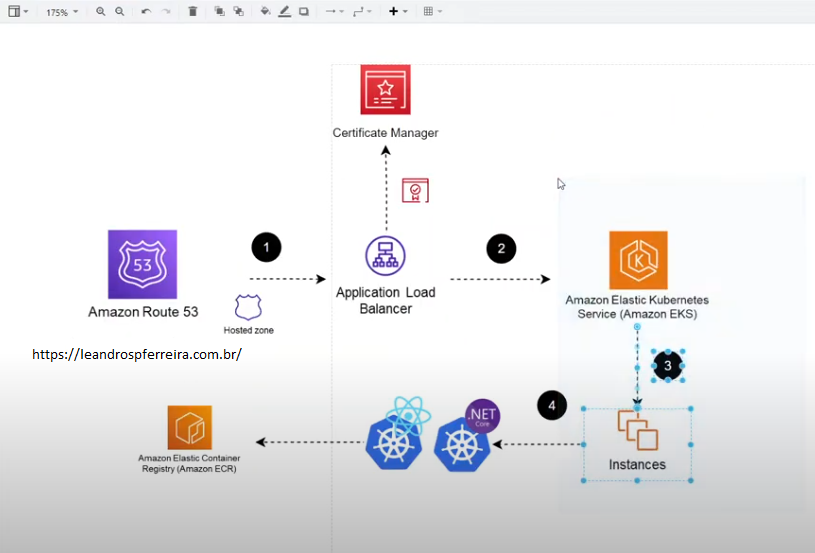
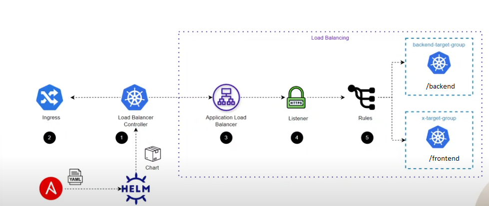
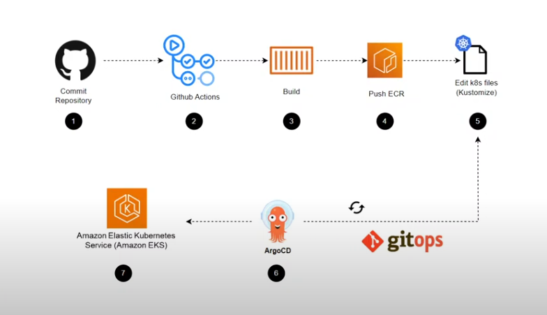
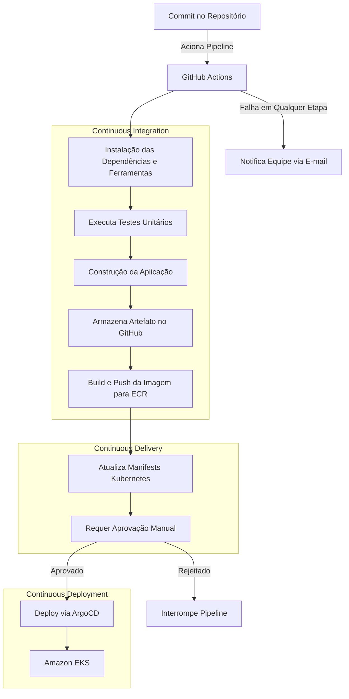

# 🚀 Arquitetura Colabkids com Amazon EKS

Este repositório contém a implementação de uma arquitetura completa de aplicações containerizadas utilizando **Amazon Elastic Kubernetes Service (EKS)**, junto com um pipeline de CI/CD baseado em GitOps para automação de deployments.

## 📊 Diagramas de Arquitetura

### Arquitetura AWS EKS


### Load Balancer Controller


### Pipeline CI/CD


## 📋 Índice

- [Visão Geral](#visão-geral)
- [Arquitetura de Aplicação](#arquitetura-de-aplicação)
- [Load Balancer Controller](#load-balancer-controller-no-eks)
- [Infraestrutura com Terraform](#arquitetura-aws-eks-com-terraform)
- [CI/CD Pipeline](#cicd-pipeline-com-github-actions-e-argocd)
- [Segurança e Permissões](#segurança-e-permissões)
- [Tecnologias e Linguagens](#tecnologias-e-linguagens)
- [Como Executar](#como-executar)

## 🌐 Visão Geral

A solução implementa uma arquitetura completa para hospedagem e gerenciamento de aplicações containerizadas na AWS, utilizando **Amazon EKS** como plataforma principal de orquestração de contêineres. A infraestrutura é provisionada usando **Terraform**, o tráfego é gerenciado através do **AWS Application Load Balancer (ALB)** e o deploy contínuo é realizado através de um pipeline **GitOps** com **GitHub Actions** e **ArgoCD**.

## 🏗️ Arquitetura de Aplicação

> **Nota de Segurança**: Este projeto utiliza o conceito de **IRSA (IAM Roles for Service Accounts)** para gerenciar permissões entre os serviços AWS e Kubernetes, eliminando a necessidade de gerenciar credenciais AWS manualmente. As chaves de segurança e configurações estão armazenadas no repositório Git usando práticas seguras de gerenciamento de segredos.

Esta parte implementa uma arquitetura baseada em **Amazon EKS** para hospedagem e gerenciamento de aplicações em contêineres, com foco em alta disponibilidade e segurança.

### Componentes

1. **Amazon Route 53**
   - Serviço de DNS para gerenciar o domínio `leandrospferreira.com.br`
   - Configuração de **Hosted Zone** para direcionar tráfego ao ALB

2. **Application Load Balancer (ALB)**
   - Recebe tráfego externo e distribui para os serviços no cluster EKS
   - Configurado para conexões HTTPS seguras com certificado do Certificate Manager

3. **Amazon Elastic Kubernetes Service (EKS)**
   - Hospeda pods e serviços que executam as aplicações em contêineres
   - O tráfego é roteado do ALB para os pods usando regras de Ingress
   - Instâncias EC2 ou Fargate para executar os nós do cluster

4. **Amazon Elastic Container Registry (ECR)**
   - Armazenamento e gerenciamento das imagens de contêineres
   - Os contêineres são criados a partir das imagens no ECR e implantados no EKS

### Fluxo da Arquitetura

1. **Route 53** recebe o tráfego externo para o domínio configurado
2. O tráfego é direcionado para o **ALB**, que valida o certificado usando o **Certificate Manager**
3. O **ALB** distribui o tráfego para o cluster **EKS**
4. O **EKS** executa os serviços em contêineres baseados nas imagens armazenadas no **ECR**

## 🔄 Load Balancer Controller no EKS

Esta seção descreve a implementação do **AWS Load Balancer Controller** no EKS para gerenciar a exposição das aplicações dentro de redes privadas.

### Componentes

1. **Load Balancer Controller**
   - Responsável por criar e gerenciar o ALB dentro do cluster EKS
   - Permite comunicação entre serviços internos e externos
   - Configura automaticamente o ALB com base nas definições de Ingress

2. **Ingress**
   - Configurado para agrupar várias aplicações sob um único domínio
   - Roteia o tráfego com base em regras específicas

3. **Application Load Balancer (ALB)**
   - Interface externa (internet-facing) para receber e distribuir tráfego
   - Conecta-se ao cluster Kubernetes

4. **Listener HTTPS**
   - Gerencia conexões seguras com as aplicações
   - Permite criptografia de ponta a ponta

5. **Rules (Regras)**
   - Definem como o tráfego será roteado para diferentes serviços
   - Direcionam tráfego para os Target Groups com base em caminhos e cabeçalhos

### Target Groups

- **order-target-group** → Direciona o tráfego para o serviço `/backend`
- **x-target-group** → Direciona o tráfego para o serviço raiz `/`

### Deployment

- O **Load Balancer Controller** é implantado usando **Helm Chart**
- A automação da infraestrutura é gerenciada com **Ansible**

## 🌩️ Arquitetura AWS EKS com Terraform

Esta parte contém a infraestrutura como código (IaC) para provisionar um ambiente altamente disponível na AWS utilizando **EKS** e **Terraform**.

### Componentes Principais

- **Região e Zonas de Disponibilidade**
  - Implantação em uma região AWS (exemplo: `us-east-1`)
  - Uso de **duas Zonas de Disponibilidade (AZs)** para redundância

- **VPC e Subnets**
  - **VPC** personalizada para isolar os recursos
  - **Subnets Públicas** para acesso externo via Internet Gateway
  - **Subnets Privadas** para execução dos nós do cluster EKS

- **Rede e Roteamento**
  - **Internet Gateway** para tráfego de entrada e saída
  - **ALB** para distribuir requisições entre os serviços do Kubernetes

- **Cluster EKS**
  - Cluster Amazon EKS com autoescalonamento
  - Nós do cluster em Auto Scaling Groups dentro das subnets privadas

## 🔄 CI/CD Pipeline com GitHub Actions e ArgoCD

Esta seção detalha a configuração de uma pipeline de CI/CD baseada em GitOps para automação do deploy de aplicações no cluster Kubernetes.

### Reconciliação Contínua com ArgoCD

O projeto implementa uma abordagem GitOps usando o ArgoCD, que opera com base no princípio fundamental de **"Estado Atual vs. Estado Desejado"**:

- **Estado Desejado**: Definido pelos manifestos Kubernetes armazenados no repositório Git
- **Estado Atual**: O estado em tempo real dos recursos dentro do cluster Kubernetes
- **Reconciliação**: Processo automático que resolve as diferenças entre os dois estados

#### Como Funciona:

1. **Monitoramento Contínuo**: O ArgoCD realiza polling do repositório Git a cada 3 minutos
2. **Detecção de Discrepâncias**: Compara o estado atual do cluster com o estado desejado definido no Git
3. **Sincronização Automática**: Aplica as alterações necessárias para alinhar o cluster ao estado desejado
4. **Health Checks**: Verifica a integridade das aplicações após cada sincronização
5. **Ações Corretivas (Overhard)**: Automaticamente corrige desvios no cluster, mesmo aqueles causados por alterações manuais

Esta abordagem garante:
- **Imutabilidade da Infraestrutura**: Mudanças são sempre realizadas através do Git
- **Auditabilidade Completa**: Todas as alterações são rastreáveis através do histórico do Git
- **Auto-recuperação**: O cluster sempre retorna ao estado desejado em caso de desvios
- **Reversibilidade**: Facilidade para reverter a um estado anterior através do Git

### Fluxo da Pipeline

1. **Commit no Repositório:** Pipeline acionada por commits na branch `main`
2. **Execução do GitHub Actions:** Orquestração de todas as etapas do CI/CD
3. **Instalação das Dependências:** Kustomize para gerenciar configurações
4. **Execução de Testes Unitários:** Garantia da integridade do código
5. **Construção da Aplicação:** Compilação e empacotamento do código-fonte
6. **Armazenamento do Artefato:** Artefato armazenado como release no GitHub
7. **Armazenamento no Amazon ECR:** Imagem enviada para o ECR
8. **Edição dos Arquivos Kubernetes (Kustomize):** Atualização dos manifests
9. **Aprovação Manual para Deploy:** Via Environment do GitHub, o que requer um revisor designado para aprovar explicitamente o deployment, garantindo uma camada adicional de segurança e conformidade
10. **Deploy com ArgoCD:** Sincronização dos manifests e deploy no EKS
11. **Notificações:** Alertas em caso de falhas

### Processo de Aprovação Manual

O pipeline inclui uma etapa crítica de aprovação manual antes que qualquer alteração seja aplicada ao ambiente de produção:

1. **Configuração de Environments no GitHub:**
   - O repositório utiliza [GitHub Environments](https://docs.github.com/en/actions/deployment/targeting-different-environments/using-environments-for-deployment) para proteger o ambiente de produção
   - Revisores designados recebem notificações quando um deployment está aguardando aprovação

2. **Processo de Revisão:**
   - Os revisores podem examinar as alterações propostas no código
   - Podem visualizar os resultados dos testes e validações anteriores
   - Têm a opção de aprovar ou rejeitar o deployment

3. **Pós-Aprovação:**
   - Após aprovação, o pipeline atualiza automaticamente os manifestos no repositório Git
   - O ArgoCD detecta essas alterações e realiza a sincronização seguindo o processo descrito anteriormente

4. **Auditoria:**
   - Todas as aprovações e rejeições são registradas no histórico do GitHub
   - Cada deployment mantém um registro completo de quem o aprovou e quando

Esta abordagem de "quatro olhos" garante que:
- Nenhuma alteração é aplicada ao ambiente de produção sem revisão humana
- Há clara atribuição de responsabilidade para cada deployment
- Existe uma trilha de auditoria para fins de conformidade
- As mudanças são controladas e documentadas

### Estrutura da Pipeline

A pipeline de CI/CD implementa um fluxo completo do código-fonte até o deployment em produção, com pontos de controle e validação em cada etapa:



#### Detalhes das Etapas:

1. **Trigger**: Um commit no branch principal aciona automaticamente o workflow do GitHub Actions
   - O workflow é definido no arquivo `.github/workflows/continuous-deployment.yml`

2. **Setup**: Instalação de todas as dependências e ferramentas necessárias
   - Kustomize, kubectl, AWS CLI e outras ferramentas são instaladas
   - Autenticação com AWS usando OIDC (eliminando necessidade de secrets)

3. **Testes**: Execução de testes unitários e de integração
   - Testes .NET usando o framework de testes integrado
   - Testes frontend usando a configuração do npm test
   - Falha nos testes interrompe o pipeline imediatamente (exceto para testes frontend que continuam mesmo com falhas)

4. **Build da Aplicação**: Compilação do código-fonte
   - Backend: Build com dotnet para aplicação .NET 7.0
   - Frontend: Build com npm para aplicação Next.js
   - Geração de artefatos otimizados para produção
   - Artefatos empacotados como arquivos tar.gz

5. **Publicação de Artefatos**: Armazenamento no GitHub Releases
   - Versionamento semântico aplicado automaticamente
   - Geração de changelogs baseados nos commits

6. **Construção e Publicação de Imagens**:
   - Build de imagens Docker otimizadas e seguras
   - Multi-stage builds para reduzir tamanho final
   - Scan de segurança das imagens antes do push
   - Push para Amazon ECR com tags apropriadas

7. **Atualização dos Manifestos**:
   - Modificação automática dos arquivos Kustomize
   - Commit automático com a mensagem "[Bot] Updating images for deployment"
   - Estratégias de retry implementadas para lidar com conflitos

8. **Aprovação Manual**:
   - Notificação para revisores designados
   - Interface de revisão com detalhes das mudanças
   - Timeout configurável para aprovações pendentes

9. **Deployment via ArgoCD**:
   - ArgoCD detecta mudanças nos manifestos a cada 3 minutos
   - Sincronização com retry automático em caso de falhas
   - Validações de saúde pós-deployment

10. **Tratamento de Falhas**:
    - Sistema de notificação por e-mail para sucesso ou falha do pipeline
    - E-mails detalhados com informações sobre o commit, autor e componentes atualizados
    - Links para logs detalhados em caso de falha

Esta estrutura garante um processo robusto, auditável e seguro, com os princípios de GitOps aplicados em todo o fluxo.

## 🚀 Como Executar

### 0. Instalar Dependências

Antes de começar, instale as seguintes ferramentas:

- **AWS CLI**: [https://docs.aws.amazon.com/cli/latest/userguide/getting-started-install.html](https://docs.aws.amazon.com/cli/latest/userguide/getting-started-install.html)
- **Terraform**: [https://developer.hashicorp.com/terraform/install](https://developer.hashicorp.com/terraform/install)
- **Kubectl**: [https://kubernetes.io/docs/tasks/tools/](https://kubernetes.io/docs/tasks/tools/)
- **Docker**: [https://docs.docker.com/engine/install/](https://docs.docker.com/engine/install/)
- **Ansible**: [https://docs.ansible.com/ansible/latest/installation_guide/intro_installation.html](https://docs.ansible.com/ansible/latest/installation_guide/intro_installation.html)
- **Helm**: [https://helm.sh/docs/intro/install/](https://helm.sh/docs/intro/install/)
- **GitHub Actions**: [https://docs.github.com/en/actions/security-guides/automatic-token-authentication](https://docs.github.com/en/actions/security-guides/automatic-token-authentication)

### 1. Provisionar Infraestrutura com Terraform

```bash
# Clone o repositório
git clone https://github.com/colabkids-2025/trabalho-ci-cd
cd trabalho-ci-cd/iac/eks

# Inicializar Terraform
terraform init

# Planejar a execução
terraform plan

# Aplicar as mudanças
terraform apply
```

### 2. Configurar o Load Balancer Controller

As configurações do Helm para o Load Balancer Controller estão disponíveis no diretório de Kustomization do projeto. Para aplicar:

```bash
# Navegar até o diretório de kustomization
cd kustomize/overlays/aws-load-balancer-controller

# Aplicar as configurações usando kustomize
kubectl apply -k .
```

Alternativamente, você pode instalar diretamente com Helm:

```bash
# Instalar o Helm Chart
helm repo add eks https://aws.github.io/eks-charts
helm repo update
helm install aws-load-balancer-controller eks/aws-load-balancer-controller \
  -n kube-system \
  --set clusterName=<seu-cluster> \
  --set serviceAccount.create=false \
  --set serviceAccount.name=aws-load-balancer-controller
```

### 3. Configurar ArgoCD para CI/CD

```bash
# Instalar ArgoCD
kubectl create namespace argocd
kubectl apply -n argocd -f https://raw.githubusercontent.com/argoproj/argo-cd/stable/manifests/install.yaml

# Configurar monitoramento de repositório com intervalo de sincronização de 3 minutos
argocd app create app-name \
  --repo https://github.com/colabkids-2025/trabalho-ci-cd.git \
  --path kustomize/overlays/production \
  --dest-server https://kubernetes.default.svc \
  --dest-namespace default \
  --sync-policy automated \
  --auto-prune \
  --self-heal \
  --sync-option Prune=true \
  --sync-option ApplyOutOfSyncOnly=true \
  --sync-option ServerSideApply=true \
  --sync-option Replace=true \
  --refresh 180

# Configurar repositório Git no ArgoCD
argocd repo add https://github.com/colabkids-2025/trabalho-ci-cd.git --name app-repo
```

## 🔐 Segurança e Permissões

Este projeto implementa o conceito de **IRSA (IAM Roles for Service Accounts)**, uma prática recomendada de segurança da AWS para Kubernetes que:

- Elimina a necessidade de armazenar credenciais AWS como secrets no Kubernetes
- Proporciona permissões granulares através de roles IAM para serviços específicos
- Permite que pods assumam roles IAM através de Service Accounts do Kubernetes
- Melhora significativamente a postura de segurança seguindo o princípio de menor privilégio

As configurações de segurança, incluindo as definições de roles e políticas, estão armazenadas de forma segura no repositório Git, permitindo gerenciamento como código e auditoria completa das mudanças através do histórico de commits.

Para implementar IRSA no seu ambiente, o projeto configura:
1. Um provedor OIDC para o cluster EKS
2. Roles IAM com relações de confiança para Service Accounts específicos
3. Anotações nos Service Accounts Kubernetes para associá-los às roles IAM

## 🛠️ Tecnologias Utilizadas

- **AWS EKS**: Orquestração de contêineres gerenciada
- **AWS Route 53**: Gerenciamento de DNS
- **AWS Certificate Manager**: Gerenciamento de certificados SSL/TLS
- **AWS ECR**: Registro de contêineres
- **Backend**: .NET 7.0
- **Frontend**: Node.js com Next.js
- **Terraform**: Provisionamento da infraestrutura como código, incluindo configuração de IRSA
- **Kubernetes**: Orquestração de contêineres
- **Helm**: Gerenciamento de pacotes para Kubernetes
- **GitHub Actions**: Automação da pipeline de CI/CD
- **ArgoCD**: Implementação de GitOps para deployment contínuo
- **Kustomize**: Gerenciamento de configurações Kubernetes
- **Ansible**: Automação da configuração


Desenvolvido por Colabkids# trabalho-ci-cd
